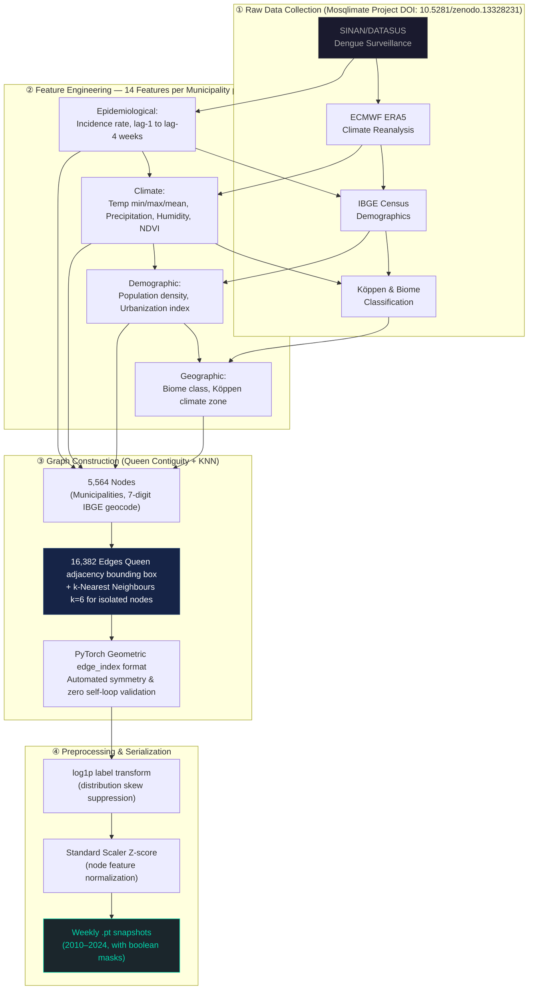

# 🦟 Sheaf Attention Networks for Dengue Outbreak Forecasting in Brazil

<p align="center">
  
  
  
  
  
  
</p>

<p align="center">
  <strong>Official University Student Research Project · Ho Chi Minh City Open University · Project Code 594</strong><br>
  Student Principal Investigator: Huynh Le Thanh Hai · Budget: VND 5,000,000 · Team: 3 members<br>
  Validated by physician at Hospital for Tropical Diseases (Bệnh Viện Bệnh Nhiệt Đới)
</p>

---

## 🏆 Key Results at a Glance

| Model Architecture | R² (Test 2023–2024) | R² Trimmed (1st-99th pct) | Mean Absolute Error (log) | Area Under Receiver Operating Characteristic Curve |
|---|:---:|:---:|:---:|:---:|
| Simple Graph Neural Network (Baseline) | — | — | — | — |
| Graph Convolutional Network | — | — | — | — |
| Spatio-Temporal Graph Attention Network | 0.758 | 0.792 | 0.318 | 0.975 |
| Sheaf Neural Network (Baseline Topology) | — | — | — | — |
| **🏆 Sheaf-Connection Neural Network** | **0.966** | **—** | **0.042** | **0.999** |

> **Strict Leakage-Free Temporal Split:** Train 2010–2020 / Validation 2021–2022 / Test 2023–2024 (held-out, never seen during training or early stopping).

---

## 📖 Research Overview & Academic Gap

This project proposes a **spatio-temporal graph-based forecasting framework** at the municipality level to monitor dengue fever outbreaks across Brazil. Instead of classical time-series models, this research pioneers **Topological Graph Learning** — specifically Sheaf Neural Networks — to capture complex geographic and epidemiological heterogeneity that standard Graph Neural Networks cannot handle.

### The Core Research Question

> *Can Sheaf Neural Networks — which model municipalities as non-homophilic (heterogeneous) nodes via Algebraic Topology — outperform classical graph architectures at predicting dengue outbreak weeks on 14 years of epidemiological data?*

### Motivation: Why Graph Learning? Why Sheaf Theory?

Classical graph neural networks assume **homophily** — that connected nodes (municipalities) are similar and should be aggregated uniformly. This assumption **breaks down** for Brazilian dengue epidemiology:

- An urban megacity (São Paulo) and a rural Amazon municipality share a graph edge, but have entirely different outbreak dynamics.
- Disease transmission from city A to neighboring city B is **asymmetric** — commute flows, river routes, and climate gradients create directional spread patterns.
- Standard Laplacian-based aggregation dampens the heterogeneous signals that matter most for outbreak detection.

**Sheaf Neural Networks** solve this by assigning each graph edge a learnable **Restriction Map** `F(v→e)` — a function that transforms a node's local feature space before aggregating into the edge space. The **Sheaf-Connection Neural Network** extends this with asymmetric 2D rotation-based Connection Maps, enabling direction-aware, non-symmetric disease transmission modeling.

---

## 📊 Data Engineering Pipeline



### Data Sources & Attribution

All datasets are derived from the **Mosqlimate Project** (Infodengue–Mosqlimate Sprint/Dengue Challenge) published on Zenodo (DOI: `10.5281/zenodo.13328231`), distributed under Creative Commons Attribution 4.0 (CC BY 4.0).

| Domain | Source | Coverage | Imputation Strategy |
|---|---|---|---|
| Dengue cases | SINAN/DATASUS | Brazil, 2010–2024 | Filled `0` (reflects true non-reporting) |
| Climate | ECMWF ERA5 | 5,564 municipalities, weekly | Filled with mean (preserves regional stability) |
| Demographics | IBGE Census | 5,564 municipalities | Nearest-year imputation to prevent temporal gaps |
| Biome/Geo | IBGE GeoJSON | Brazil (WGS84 EPSG:4326) | Polyconic flat projection EPSG:5880 for centroids |

---

## 🔬 The Five Graph Neural Network Architectures Benchmarked

### Architecture 1 — Simple Graph Neural Network

```
MessagePassing (aggr='mean') → Linear → ReLU → Dropout → Linear → ReLU → Dropout → Output
```

Baseline architecture using standard mean-aggregation message passing. Assumes **perfect homophily**: all neighbors contribute equally with no directional awareness. 
**Limitation:** Cannot capture heterogeneous transmission dynamics between municipalities of different sizes, climates, or urbanization levels.

---

### Architecture 2 — Graph Convolutional Network

```
GCNConv (spectral) → ReLU → Dropout → GCNConv → ReLU → Dropout → Linear → Output
```

Applies spectral filtering via the **symmetric normalized Laplacian** `D^{-1/2} A D^{-1/2}`. Aggregation weights are proportional to node degree — larger-degree municipalities contribute less per edge. Still assumes homophily.
**Limitation:** Symmetric aggregation cannot represent asymmetric disease spread; rural-urban transmission asymmetry is invisible to this model.

---

### Architecture 3 — Spatio-Temporal Graph Attention Network

```
Temporal Encoder:
  Lag sequence [N, T, F_lag] → Gated Recurrent Unit (hidden=64) → Multi-Head Attention (4 heads)
Spatial Encoder:
  [Node features ‖ temporal embedding] 
    → Graph Attention Convolution Layer 1 (4 heads, concat=True) → [N, 128×4]
    → Graph Attention Convolution Layer 2 (4 heads, concat=False) → [N, 128]
    → Linear → [N, 1]
```

Introduces **adaptive spatial attention** (α_ij per edge, learned) combined with **temporal sequential modeling**. Each municipality dynamically weights the influence of its neighbors based on current epidemic state.
**Hyperparameters:** `hidden=128, heads=(4,4), lr=3e-4, weight_decay=1e-4, dropout=0.2`.

---

### Architecture 4 — Sheaf Neural Network (Topology Baseline)

Replaces the standard adjacency-based Laplacian with the **Sheaf Laplacian** `L_F`. For each directed edge `(u, v)`, a **Restriction Map** `F(u→e)` maps the node's feature vector into the edge's stalk space: `L_F = B^T diag(F_e^T F_e) B`. This breaks the homophily assumption for the first time in this benchmark.

---

### Architecture 5 — Sheaf-Connection Neural Network 🏆 Best Model

```
For each directed edge (src → dst):
  Edge Multi-Layer Perceptron:
    [h_src ‖ h_dst ‖ |h_src - h_dst|] → S rotation angles θ per stalk
  Rotation matrix per stalk (2×2):
    R(θ) = [[cos θ, -sin θ], [sin θ,  cos θ]]
  Restriction map (Connection Map):
    mapped_src = einsum("esab,esb→esa", R, h_src_stalk)
  Disagreement signal:
    diff = mapped_src - h_dst_stalk
  Aggregation (minimize sheaf disagreement):
    agg = 0.5 * (agg_dst + agg_src)
```

**Key insight:** The rotation-based Connection Map `R(θ)` for each directed edge is **asymmetric** — disease flowing from city A to city B uses a different rotation than B to A. This captures the directional nature of dengue spread along commute routes, river valleys, and climate gradients.
**Hyperparameters:** `hidden=64, stalk_dim=2, num_stalks=32, lr=1e-4, weight_decay=5e-4, dropout=0.2`.

---

## 🔄 Business Process Model — Research Workflow (BPMN)


---

## ⚙️ Training, Optimization, & Bias-Correction

### Setup & Loss Function
The model trains using **Huber Loss (δ=1.2)**, chosen specifically because epidemiological data contains extreme outliers (massive outbreaks) that destroy Mean Squared Error optimization, while Mean Absolute Error is too insensitive to small shifts.

```python
optimizer = torch.optim.AdamW(model.parameters(), lr=lr, weight_decay=wd)
loss_fn   = nn.HuberLoss(delta=1.2)   # outlier-robust regression
torch.nn.utils.clip_grad_norm_(model.parameters(), max_norm=1.0) # stabilizes Sheaf Laplacian backpropagation
```

### Bias-Correction at Inference (Real-Space Mapping)
Because validation/test labels are log1p-transformed (`log(1+cases)`), naive back-transformation via `expm1(ŷ)` is mathematically biased. This project implements the **Duan Smearing Estimator** for log-normal correction:

```python
smear = np.mean(np.exp(residuals_train))    # E[e^ε] from training residuals
y_real = torch.exp(y_log) * smear - 1.0
```
As a fallback when residuals are highly skewed, Gaussian variance shift `torch.expm1(y_log + 0.5 * sigma2)` is utilized. A 99.9th percentile headroom clamp prevents exploding predictions during unseen extreme outbreak peaks.

### Robust Metrics
- **Trimmed R² (1st–99th percentile):** R² completely collapses if a single municipality reports a massive outlier outbreak. Trimmed R² clips the top 1% of absolute errors to evaluate the model's *foundational* predictive capability on 99% of normal data.
- **ROC-AUC & PR-AUC:** Derived functionally from continuous regression outputs by thresholding at the 90th percentile of historical incidence. Precision-Recall AUC is particularly evaluated due to the heavy class imbalance (outbreaks are rare).

---

## 🌐 Spatio-Temporal Capstone Dashboard (Offline-First Big Data)

A nationwide interactive dashboard was built as a capstone thesis (Jul–Sep 2025) extending this research to all 5,564 Brazilian municipalities with 16,382 graph edges.

**Big Data Architecture:**
- **Zero-Server Infrastructure:** Entirely offline (Mapbox GL JS + Plotly JS) meaning healthcare workers in remote areas can run the dashboard natively in their browser without a Flask/Node.js backend.
- **Hive-Partitioned Parquet:** 4.2 million node-predictions are stored using PyArrow 21+ in Hive partitioning (`node_predictions_ds/Year=YYYY/Epiweek=WW/`), compressed with Zstandard (`zstd`) and 128k row groups. This allows the dashboard to selectively lazy-load only the requested epidemiological week into memory instantly.
- **Multi-Layer Visualization:** Traceable Z-index logic supports 7 layers: Biome overlays, True Choropleths (Turbo colormap), Prediction Choropleths, Residual diverging maps (RdBu), Density heatmaps, and Graph Edge network arrays.

---

## 🗂️ Repository Structure

```
.
├── models/
│   ├── simple_gnn.py          # Architecture 1: Simple message passing baseline
│   ├── gcn_model.py           # Architecture 2: Graph Convolutional Network
│   ├── temporal_gat.py        # Architecture 3: Spatio-Temporal Graph Attention Network
│   ├── sheaf_model.py         # Architecture 4: Sheaf Neural Network baseline
│   ├── sheaf_connection.py    # Architecture 5: Sheaf-Connection Neural Network (best)
│
├── trainers/
│   └── trainer_weekly.py      # Temporal sequence builder, temporal lag parsing
│
├── utils/
│   ├── buoc1taoedge.py        # Graph edge construction (Queen contiguity, KNN=6, WGS84)
│   ├── buoc2taofeature.py     # Feature + label engineering, time-series deduplication
│   ├── buoc3_scale.py         # Standard Scaler, log1p transform (Z-score)
│   ├── buoc4_check_scaled.py  # Sanity checks for graph structure masks
│
├── run_global_gat.py          # Main entry point: epoch iteration, Huber loss, metrics
├── export_dashboard.py        # PyArrow Parquet generator & self-contained HTML builder
└── README.md                  # This documentation
```

---

## 🚀 Quick Start

### 1. Clone & Install

```bash
git clone https://github.com/danielhuynh-04/Sheaf-Attention-Networks-in-forecasting-Dengue-fever-in-Brazil.

cd Sheaf-Attention-Networks-in-forecasting-Dengue-fever-in-Brazil.

pip install torch torchvision torchaudio --index-url https://download.pytorch.org/whl/cpu
pip install torch-geometric pandas numpy scikit-learn pyarrow
```
*(Contact author for the `.pt` temporal snapshot weights suppressed by `.gitignore`).*

### 2. Train a Model

```bash
# Train the best model (Sheaf-Connection Neural Network)
python run_global_gat.py --model sheaf_conn --epochs 200

# Train and compare Spatio-Temporal Graph Attention Network
python run_global_gat.py --model gat --epochs 200
```

### 3. Evaluate Only & Export Predictions (For Dashboard)

```bash
python run_global_gat.py --model sheaf_conn --eval_only 1 --export_predictions 1
```

---

## 🛠️ Technology Stack

| Category | Tools |
|---|---|
| Core Language | Python 3.10, SQL, JavaScript |
| Deep Learning | PyTorch, PyTorch Geometric, torch.nn |
| Big Data Analytics | PyArrow (Parquet, Hive Partitioning, Zstd), Pandas, NumPy |
| Graph Learning | Graph Convolutional Network, Graph Attention Network, Sheaf Laplacian, Connection Maps |
| Evaluation Metrics | ROC-AUC, PR-AUC, SMAPE, Trimmed R², Duan Smearing, Huber Loss |
| Geospatial | GeoJSON, WGS84 EPSG:4326/EPSG:5880 projections, K-Nearest Neighbors |
| Visualization | Plotly Express, Mapbox GL JS |

---

## 👤 Author

**Huynh Le Thanh Hai**
Final-year Computer Science student, Ho Chi Minh City Open University (High-Quality 100% English Program)

- 📧 Haiworkai@gmail.com
- 💼 [LinkedIn](https://linkedin.com/in/le-thanh-hai-huynh-8353913a1)
- 🔬 [Kaggle Publication](https://kaggle.com/lthanhhihunh)
- 🐱 [GitHub](https://github.com/danielhuynh-04)

---

## 📄 License

This project is open source. Dataset reproduction requires access to Mosqlimate Project datasets (CC BY 4.0).
