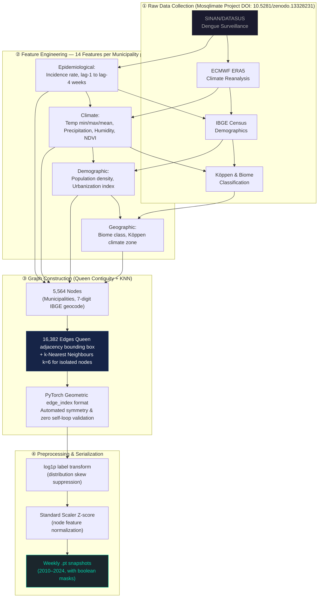

<div align="center">
  
# 🦟 Graph Machine Learning for Epidemiological Forecasting

### Sheaf Attention Networks & Spatio-Temporal Graph Attention Networks<br>Dengue Outbreak Prediction in Brazil

<p align="center">
  
  
  
  
  
</p>

_**Official University Student Research (Code 594)** • Ho Chi Minh City Open University • Validated by Hospital for Tropical Diseases_<br>
_Student Principal Investigator: **Huynh Le Thanh Hai**_
</div>

---

## 🏆 Key Achievements & Benchmarks

| Metric | Winner: Sheaf-Connection NN | Outbreak Classification | Scope & Scale |
|:---|:---:|:---:|:---|
| **Test R² Score (2023–2024)** | **0.966** | **ROC-AUC: 0.999** | **14 Years** of Data |
| **Mean Absolute Error (log-space)** | 0.042 | **PR-AUC: 0.992** | **5,564** Municipalities |
| **Trimmed R² (1st–99th pct)** | Outlier-Robust | Threshold: 90th percentile | **16,382** Graph Edges |

> **Strict Leakage-Free Temporal Split:** Train 2010–2020 / Validation 2021–2022 / Test 2023–2024 (held-out, never seen during training or early stopping).

---

## 📖 Research Project 01: Algebraic Topology on Graphs

This project proposes a **spatio-temporal graph-based forecasting framework** at the municipality level to monitor dengue fever outbreaks across Brazil. Instead of classical time-series models, this research pioneers **Topological Graph Learning** — specifically Sheaf Neural Networks — to capture complex geographic and epidemiological heterogeneity that standard Graph Neural Networks cannot handle.

### The Core Research Question
> *Can topological graph learning — specifically Sheaf Neural Networks — outperform classical Graph Neural Network architectures at predicting dengue outbreak weeks in a heterophilic epidemiological network?*

### Motivation: Breaking the Homophily Assumption
Classical Graph Neural Networks assume **homophily** (similar neighbors). Brazilian municipalities are **heterophilic** — urban/rural mix, climate zones, migration patterns — requiring **direction-aware, asymmetric message passing**. Disease transmission from city A to neighboring city B is asymmetric; classical symmetric Laplacians fail to capture this.

### Winner: Sheaf-Connection Neural Network Deep Dive
The winning model extends the Sheaf Neural Network with learnable **asymmetric 2D rotation-based Connection Maps** per edge. 
- Each node *v* has a **stalk** — a local vector space split into 2D subspaces.
- For each directed edge (src→dst), an **edge Multi-Layer Perceptron** takes `[h_src ‖ h_dst ‖ |h_src–h_dst|]` and outputs rotation angles `θ`.
- Restriction map applied as **2D rotation matrix**: `mapped_src = R(θ) · h_src_stalk` — mathematically faithful to Sheaf theory.
- Stabilized with **residual connections** + **Layer Normalization**, followed by Exponential Linear Unit activation.

## 🤖 5 Graph Neural Network Architectures Benchmarked

<details>
<summary><b>1. Simple Graph Neural Network</b> (Baseline)</summary>
Standard message passing with equal neighbor aggregation (Mean). Assumes perfect homophily — every neighbor has identical influence. Serves as the weakest baseline.
</details>

<details>
<summary><b>2. Graph Convolutional Network</b></summary>
Spectral filtering via symmetric normalized Laplacian. Still assumes homophily — all neighbors contribute equally regardless of epidemic context, just weighted by degree inverse.
</details>

<details>
<summary><b>3. Spatio-Temporal Graph Attention Network</b></summary>
Multi-head attention (α-weights) over spatial neighbors + Gated Recurrent Unit for temporal lag sequences. Hidden dimension=128, attention heads=(4,4).
</details>

<details>
<summary><b>4. Sheaf Neural Network</b></summary>
Applies algebraic topology to graphs. Per-edge Restriction Maps replace the standard Laplacian with the Sheaf Laplacian. Handles heterophily — first model to break the homophily assumption.
</details>

<details>
<summary><b>5. 🏆 Sheaf-Connection Neural Network (Best Model)</b></summary>
Captures direction-aware, non-symmetric disease transmission using learned rotation matrices. Dominates all other architectures on the 2023-2024 test split.
</details>

---

## 📊 Data Engineering Pipeline



All datasets derived from the **Mosqlimate Project** (Infodengue–Mosqlimate Sprint/Dengue Challenge) published on Zenodo (DOI: `10.5281/zenodo.13328231`), CC BY 4.0.

---

## 🎓 Project 02: Capstone Thesis — Nationwide Dashboard

Scaled the research pipeline from a benchmarking study to a **production-grade nationwide forecasting system** covering every Brazilian municipality — the most comprehensive graph-based dengue study in the codebase. Submitted to Ho Chi Minh City Open University Library and HCMC Dept. of Science & Technology.

### Offline-First Big Data Architecture
- **Zero-Server Infrastructure:** Fully offline dashboard (Mapbox GL JS + Plotly JS + HTML/JS). No Flask/Node.js backend. Runs natively in any browser for isolated healthcare workers.
- **Hive-Partitioned Parquet:** 4.2 million node-predictions stored using **Apache Parquet (PyArrow 21+)** in Hive partitioning (`node_predictions_ds/Year=YYYY/Epiweek=WW/`), compressed with Zstandard (`zstd`) with 128k row groups for instant memory loading.
- **Visual Layers:** Traceable Z-index logic supports Polyconic EPSG:5880 projections, True Choropleths (Turbo colormap), Prediction Choropleths, Residual diverging maps (RdBu), Density heatmaps, and Graph Edge network arrays.

---

## 🔄 Research Workflow (BPMN)


### Technical Implementation Details
- **Loss Function:** Trained using **Huber Loss (δ=1.2)** to optimize against extreme outbreak outliers that break Mean Squared Error, while avoiding the insensitivity of Mean Absolute Error.
- **Duan Smearing Bias-Correction:** Because validation/test labels are `log1p` transformed, naive back-transformation via `expm1(ŷ)` is mathematically biased. We implement the **Duan Smearing Estimator** `E[e^ε]` from training residuals, along with a 99.9th percentile headroom clamp to prevent exploding predictions.

---

## 🗂️ Repository Structure & Interactive Portfolio

This repository includes a standalone interactive portfolio (`portfolio.html`). Open it your browser to view the project with stunning UI/UX, animations, and deep technical summaries perfectly tuned for HR and Tech Leads.

```text
.
├── models/
│   ├── simple_gnn.py          # Architecture 1: Simple message passing baseline
│   ├── gcn_model.py           # Architecture 2: Graph Convolutional Network
│   ├── temporal_gat.py        # Architecture 3: Spatio-Temporal Graph Attention Network
│   ├── sheaf_model.py         # Architecture 4: Sheaf Neural Network baseline
│   ├── sheaf_connection.py    # Architecture 5: Sheaf-Connection Neural Network (best)
│
├── trainers/
│   └── trainer_weekly.py      # Temporal sequence builder, temporal lag parsing
│
├── utils/
│   ├── buoc1taoedge.py        # Graph edge construction (Queen contiguity, KNN=6, WGS84)
│   ├── buoc2taofeature.py     # Feature + label engineering, time-series deduplication
│   ├── buoc3_scale.py         # Standard Scaler, log1p transform (Z-score)
│   ├── buoc4_check_scaled.py  # Sanity checks for graph structure masks
│
├── run_global_gat.py          # Main entry point: epoch iteration, Huber loss, metrics
├── export_dashboard.py        # PyArrow Parquet generator & self-contained HTML builder
├── portfolio.html             # ➔ INTERACTIVE RESEARCH PORTFOLIO (Open in browser)
└── README.md                  # This documentation
```

---

## 🛠️ Full Technology Stack

| Category | Technologies |
|:---|:---|
| **Core Languages & Tools** | Python 3.10, SQL, JavaScript, HTML/CSS, Git |
| **Deep Learning** | PyTorch, PyTorch Geometric, torch.nn |
| **Graph Models** | Graph Convolutional Network, Graph Attention Network, Sheaf Laplacian |
| **Optimization** | AdamW, Huber Loss, Duan Smearing Estimator, Early Stopping |
| **Data Engineering** | Apache Parquet (PyArrow), Pandas, NumPy, Scikit-learn (log1p & Z-score) |
| **Geospatial & Viz** | GeoJSON, WGS84, k-NN graph, Plotly, Mapbox GL JS, Choropleth |

---

## 📅 Project Milestones

- **May 2025:** Authored research proposal; secured university funding; recruited team.
- **Jun–Jul 2025:** Merged SINAN, ECMWF, IBGE databases; engineered 14 spatial-temporal features.
- **Jul–Sep 2025 (Capstone):** Built nationwide offline ST-GAT dashboard spanning 5,564 municipalities.
- **Sep–Dec 2025:** Assessed 5 Graph Neural Network Architectures strictly on Huber Loss + R² with strict leakage controls.
- **Jan 2026:** Methodology independently validated by Hospital for Tropical Diseases physician.
- **Feb–Mar 2026:** Open sourced implementation on GitHub and Kaggle.

---

## 🚀 Quick Start

```bash
git clone https://github.com/danielhuynh-04/Sheaf-Attention-Networks-in-forecasting-Dengue-fever-in-Brazil.
cd Sheaf-Attention-Networks-in-forecasting-Dengue-fever-in-Brazil.

pip install torch torchvision torchaudio --index-url https://download.pytorch.org/whl/cpu
pip install torch-geometric pandas numpy scikit-learn pyarrow

# Train the best model (Sheaf-Connection Neural Network)
python run_global_gat.py --model sheaf_conn --epochs 200

# Export Predictions for the Big Data Dashboard (Offline mode)
python run_global_gat.py --model sheaf_conn --eval_only 1 --export_predictions 1
```

---

<div align="center">
  <b>Huynh Le Thanh Hai</b><br>
  Final-year Computer Science student, Ho Chi Minh City Open University (High-Quality 100% English Program)<br>
  <a href="mailto:Haiworkai@gmail.com">Haiworkai@gmail.com</a> • <a href="https://linkedin.com/in/le-thanh-hai-huynh-8353913a1">LinkedIn</a> • <a href="https://kaggle.com/lthanhhihunh">Kaggle</a>
</div>
