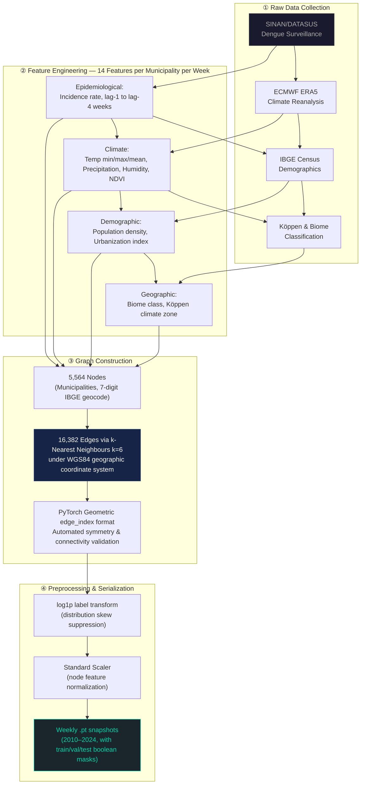

# 🦟 Sheaf Attention Networks for Dengue Outbreak Forecasting in Brazil

<p align="center">
  
  
  
  
  
  
</p>

<p align="center">
  <strong>Official University Student Research Project · Ho Chi Minh City Open University · Project Code 594</strong><br>
  Student Principal Investigator: Huynh Le Thanh Hai · Budget: VND 5,000,000 · Team: 3 members<br>
  Validated by physician at Hospital for Tropical Diseases · Published on Kaggle (100+ views, 10+ downloads)
</p>

---

## 🏆 Key Results at a Glance

| Model Architecture | R² (Test 2023–2024) | Mean Absolute Error (log) | Area Under Receiver Operating Characteristic Curve |
|---|:---:|:---:|:---:|
| Simple Graph Neural Network (Baseline) | — | — | — |
| Graph Convolutional Network | — | — | — |
| Spatio-Temporal Graph Attention Network | — | — | — |
| Sheaf Neural Network (Baseline Topology) | — | — | — |
| **🏆 Sheaf-Connection Neural Network** | **0.966** | **0.042** | **0.999** |

> **Test period: 2023–2024 (held-out, never seen during training).** Temporal split: Train 2010–2020 / Validation 2021–2022 / Test 2023–2024. Zero data leakage across temporal boundaries.

---

## 📖 Research Overview

This project proposes a **spatio-temporal graph-based forecasting framework** at municipality level to monitor dengue fever outbreaks across Brazil. Instead of classical time-series models, this research pioneers **Topological Graph Learning** — specifically Sheaf Neural Networks — to capture complex geographic and epidemiological heterogeneity that standard Graph Neural Networks cannot handle.

### The Core Research Question

> *Can Sheaf Neural Networks — which model municipalities as non-homophilic (heterogeneous) nodes via Algebraic Topology — outperform five baseline graph architectures at predicting dengue outbreak weeks on 14 years of real Brazilian epidemiological data?*

### Motivation: Why Graph Learning? Why Sheaf Theory?

Classical graph neural networks assume **homophily** — that connected nodes (municipalities) are similar and should be aggregated uniformly. This assumption **breaks down** for Brazilian dengue epidemiology:

- An urban megacity (São Paulo) and a rural Amazon municipality share a graph edge, but have entirely different outbreak dynamics
- Disease transmission from city A to neighboring city B is **asymmetric** — commute flows, river routes, and climate gradients create directional spread patterns
- Standard Laplacian-based aggregation dampens the heterogeneous signals that matter most for outbreak detection

**Sheaf Neural Networks** solve this by assigning each graph edge a learnable **Restriction Map** `F(v→e)` — a function that transforms a node's local feature space before aggregating into the edge space. The **Sheaf-Connection Neural Network** extends this with asymmetric 2D rotation-based Connection Maps, enabling direction-aware, non-symmetric disease transmission modeling.

---

## 📊 Data Engineering Pipeline



### Data Sources

| Source | Content | Coverage |
|---|---|---|
| SINAN/DATASUS | Dengue weekly case counts | Brazil, 2010–2024 |
| ECMWF ERA5 | Temperature (min/max/mean), Precipitation, Humidity, NDVI | 5,564 municipalities, weekly |
| IBGE Census | Population density, Urbanization index | 5,564 municipalities |
| Köppen Classification | Climate zone per municipality | Full Brazil |
| Biome Classification | Amazon, Cerrado, Caatinga, Atlantic Forest, Pantanal, Pampa | Full Brazil |

---

## 🔬 The Five Graph Neural Network Architectures Benchmarked

### Architecture 1 — Simple Graph Neural Network

```
MessagePassing (aggr='mean') → Linear → ReLU → Dropout → Linear → ReLU → Dropout → Output
```

Baseline architecture using standard mean-aggregation message passing. Assumes **perfect homophily**: all neighbors contribute equally with no directional awareness. This architecture processes two `SimpleConv` layers followed by a linear output head.

**Limitation:** Cannot capture heterogeneous transmission dynamics between municipalities of different sizes, climates, or urbanization levels.

---

### Architecture 2 — Graph Convolutional Network

```
GCNConv (spectral) → ReLU → Dropout → GCNConv → ReLU → Dropout → Linear → Output
```

Applies spectral filtering via the **symmetric normalized Laplacian** `D^{-1/2} A D^{-1/2}`. Aggregation weights are proportional to node degree — larger-degree municipalities contribute less per edge. Still assumes homophily.

**Limitation:** Symmetric aggregation cannot represent asymmetric disease spread; rural-urban transmission asymmetry is invisible to this model.

---

### Architecture 3 — Spatio-Temporal Graph Attention Network

```
Temporal Encoder:
  Lag sequence [N, T, F_lag]
    → GRU (Gated Recurrent Unit, hidden=64)
    → Multi-Head Attention (4 heads, self-attention over time steps)
    → Projection [N, t_hidden]

Spatial Encoder:
  [Node features ‖ temporal embedding] [N, F + t_hidden]
    → GATConv Layer 1 (4 heads, concat=True) → [N, 128×4]
    → GATConv Layer 2 (4 heads, concat=False) → [N, 128]
    → Linear → [N, 1]
```

Introduces **adaptive spatial attention** (α_ij per edge, learned) combined with **temporal sequential modeling** (Gated Recurrent Unit). Each municipality dynamically weights the influence of its neighbors based on current epidemic state.

**Hyperparameters:** `hidden=128, heads=(4,4), lr=3e-4, weight_decay=1e-4, dropout=0.2`

---

### Architecture 4 — Sheaf Neural Network (Topology Baseline)

Replaces the standard adjacency-based Laplacian with the **Sheaf Laplacian** `L_F`. For each directed edge `(u, v)`, a **Restriction Map** `F(u→e)` maps the node's feature vector into the edge's stalk space:

```
L_F = B^T diag(F_e^T F_e) B
```

where `B` is the signed incidence matrix and `F_e` are the per-edge restriction maps. This allows each edge to define its own local geometry — breaking the homophily assumption for the first time in this benchmark.

---

### Architecture 5 — Sheaf-Connection Neural Network 🏆 Best Model

```
Input [N, F]
  → Linear projection → [N, H]  (input node embedding)
  + Temporal mean-pool → LazyLinear → [N, H]  (temporal context fusion)
  → ReLU

For each directed edge (src → dst):
  Edge Multi-Layer Perceptron:
    [h_src ‖ h_dst ‖ |h_src - h_dst|] → [E, 3H]
    → Linear(3H → H) → ReLU → Dropout → Linear(H → S)
    → S rotation angles θ per stalk  [E, S]

  Rotation matrix per stalk (2×2):
    R(θ) = [[cos θ, -sin θ],
             [sin θ,  cos θ]]

  Restriction map (Connection Map):
    mapped_src = einsum("esab,esb→esa", R, h_src_stalk)  [E, S, 2]

  Disagreement signal:
    diff = mapped_src - h_dst_stalk

  Aggregation (minimize sheaf disagreement):
    agg_dst.index_add_(0, dst, -diff)   ← reduce to destination
    agg_src.index_add_(0, src, +diff)   ← reduce to source
    agg = 0.5 * (agg_dst + agg_src)    → [N, H]

  Residual + Layer Normalization:
    h = LayerNorm(h + Dropout(agg))
    h = ReLU(h)

  Output head:
    → Linear(H → H) → ReLU → Dropout → Linear(H → 1)
```

**Key insight:** The rotation-based Connection Map `R(θ)` for each directed edge is **asymmetric** — disease flowing from city A to city B uses a different rotation than B to A. This captures the directional nature of dengue spread along commute routes, river valleys, and climate gradients. The rotation angle θ is learned end-to-end from epidemiological data.

**Hyperparameters:** `hidden=64, stalk_dim=2, num_stalks=32, lr=1e-4, weight_decay=5e-4, dropout=0.2`

---

## 🔄 Business Process Model — Research Workflow (BPMN)


---

## ⚙️ Training & Optimization

### Setup

```python
optimizer = torch.optim.AdamW(model.parameters(), lr=lr, weight_decay=wd)
loss_fn   = nn.HuberLoss(delta=1.2)   # outlier-robust regression

# Gradient clipping — stabilizes Sheaf Laplacian backpropagation
torch.nn.utils.clip_grad_norm_(model.parameters(), max_norm=1.0)

# Early stopping
patience = 30   # epochs without improvement on validation loss
```

### Temporal Split (Leakage-Free)

```
Train:      2010 – 2020  (weekly snapshots, ~550 weeks)
Validation: 2021 – 2022  (104 weeks)
Test:       2023 – 2024  (104 weeks, NEVER seen during training or early-stopping)
```

### Bias-Correction at Inference

Because labels are log1p-transformed, raw model output `ŷ_log` must be back-transformed to real case counts. Naive `expm1(ŷ_log)` is biased. This project applies:

**Primary — Duan Smearing Estimator:**
```python
smear = np.mean(np.exp(residuals_train))    # E[e^ε] from training residuals
y_real = torch.exp(y_log) * smear - 1.0
```

**Fallback — σ² Shift:**
```python
sigma2 = np.var(residuals_train, ddof=1)
y_real = torch.expm1(y_log + 0.5 * sigma2)
```

**Headroom clamp:** predictions capped at the 99.9th percentile of training real values to suppress extreme outlier forecasts.

---

## 📐 Evaluation Suite

| Metric | Domain | Notes |
|---|---|---|
| Mean Absolute Error | Regression | Computed on log-space predictions |
| Root Mean Squared Error | Regression | Outlier-sensitive |
| Symmetric Mean Absolute Percentage Error | Regression | Scale-independent |
| R² (Coefficient of Determination) | Regression | Overall variance explained |
| Trimmed R² (1st–99th percentile) | Regression | Outlier-robust R² on trimmed subset |
| Area Under Receiver Operating Characteristic Curve | Classification | Outbreak-week binary detection |
| Precision-Recall Area Under Curve | Classification | Handles class imbalance well |

> ROC-AUC and Precision-Recall AUC are derived from regression scores using the **90th percentile of training incidence** as the outbreak threshold — no classification head required.

---

## 🗂️ Repository Structure

```
.
├── models/
│   ├── simple_gnn.py          # Architecture 1: Simple message passing baseline
│   ├── gcn_model.py           # Architecture 2: Graph Convolutional Network
│   ├── temporal_gat.py        # Architecture 3: Spatio-Temporal Graph Attention Network
│   ├── sheaf_model.py         # Architecture 4: Sheaf Neural Network baseline
│   ├── sheaf_connection.py    # Architecture 5: Sheaf-Connection Neural Network (best)
│   └── model_factory.py       # Unified model builder
│
├── trainers/
│   └── trainer_weekly.py      # Temporal sequence builder, model factory helpers
│
├── utils/
│   ├── buoc1taoedge.py        # Step 1: Graph edge construction (k-NN, WGS84)
│   ├── buoc2taofeature_label.py  # Step 2: Feature + label engineering
│   ├── buoc3_scale_features.py   # Step 3: Standard Scaler, log1p transform
│   ├── buoc4_check_scaled.py     # Step 4: Validation of scaled output
│   └── check.py               # Sanity checks for graph structure
│
├── run_global_gat.py          # Main entry point: training, evaluation, export
├── README.md                  # This file
└── .gitignore                 # Excludes large data artifacts and checkpoints
```

---

## 🚀 Quick Start

### 1. Clone & Install

```bash
git clone https://github.com/danielhuynh-04/Sheaf-Attention-Networks-in-forecasting-Dengue-fever-in-Brazil.

cd Sheaf-Attention-Networks-in-forecasting-Dengue-fever-in-Brazil.

pip install torch torchvision torchaudio --index-url https://download.pytorch.org/whl/cpu
pip install torch-geometric pandas numpy scikit-learn
```

> **Note:** Dataset files (weekly `.pt` snapshots, edge index, checkpoints) are excluded from this repository via `.gitignore` due to size. Contact the author for data access or reproduce via the utility scripts in `utils/`.

### 2. Train a Model

```bash
# Train the best model (Sheaf-Connection Neural Network)
python run_global_gat.py --model sheaf_conn --epochs 200

# Train and compare Spatio-Temporal Graph Attention Network
python run_global_gat.py --model gat --epochs 200

# All available models:
# gnn | gcn | gat | sheaf | sheaf_conn
```

### 3. Evaluate Only (load saved checkpoint)

```bash
python run_global_gat.py --model sheaf_conn --eval_only 1
```

### 4. Export Node-Level Predictions (for dashboard)

```bash
python run_global_gat.py --model sheaf_conn --eval_only 1 --export_predictions 1
```

### CLI Arguments

| Argument | Options | Default | Description |
|---|---|---|---|
| `--model` | `gnn, gcn, gat, sheaf, sheaf_conn` | `gat` | Architecture to train |
| `--epochs` | integer | `200` | Maximum training epochs |
| `--eval_only` | `0, 1` | `0` | Skip training, load best checkpoint |
| `--export_predictions` | `0, 1` | `0` | Export per-node predictions to CSV |

### Outputs

| File | Location | Description |
|---|---|---|
| Best model checkpoint | `checkpoints/<model>_global_best.pt` | Model state dict at best validation loss |
| Weekly report | `data/interim/<model>_global_weekly_report.csv` | Per-week evaluation metrics |
| Summary | `data/interim/<model>_global_summary.json` | Aggregated metrics for all splits |
| Epoch log | `data/interim/<model>_epoch_log.csv` | Training convergence log |
| Node predictions | `visualizations/data/<model>/node_predictions_<model>.csv` | Per-municipality predictions |

---

## 🌐 Spatio-Temporal Dashboard (Capstone Extension)

A nationwide interactive dashboard was built as a capstone thesis (Jul–Sep 2025) extending this research to all 5,564 Brazilian municipalities with 16,382 graph edges:

- **Choropleth outbreak-risk map** (Plotly Scattermapbox) — municipality-level risk visualization
- **Forecast error heatmap** (Plotly Densitymapbox) — spatial distribution of model uncertainty
- **Temporal trend charts** — weekly predicted vs. actual incidence per region
- **Zero-server architecture** — fully offline (Plotly + Mapbox GL JS + Vanilla JavaScript, no Flask backend)
- **Data exchange** — model outputs via Apache Parquet → JSON; GeoJSON/Shapefile boundary overlays

> Capstone thesis submitted to Ho Chi Minh City Open University Library and registered with the HCMC Department of Science and Technology.

---

## 📈 Research Context & Validation

This project was conducted as an **Official University Student Research Project** at Ho Chi Minh City Open University:

- **Project Code:** 594
- **Funding:** VND 5,000,000 (university research scholarship)
- **Team:** 3 members, Student Principal Investigator: Huynh Le Thanh Hai
- **Clinical Validation:** Research methodology reviewed and validated with a **physician at the Hospital for Tropical Diseases (Bệnh Viện Bệnh Nhiệt Đới)**
- **Proposed Impact:** Framework designed to be transferable to Vietnam's national dengue surveillance system
- **Publication:** Full research report submitted to Ho Chi Minh City Open University Library; code and reproducible implementation published on [Kaggle](https://kaggle.com/lthanhhihunh) — **100+ views, 10+ downloads**

---

## 🛠️ Technology Stack

| Category | Tools |
|---|---|
| Core Language | Python 3.10, SQL, JavaScript |
| Deep Learning | PyTorch, PyTorch Geometric, torch.nn |
| Graph Learning | Graph Convolutional Network (GCNConv), Graph Attention Network (GATConv), Sheaf Laplacian, custom Restriction Maps |
| Temporal Modeling | Gated Recurrent Unit (GRU), Multi-Head Attention |
| Optimization | AdamW, Huber Loss, Gradient Clipping, Early Stopping, Duan Smearing |
| Feature Engineering | Pandas, NumPy, Scikit-learn, Standard Scaler, log1p transform |
| Geospatial | GeoJSON, Shapefile, WGS84 coordinate system, IBGE geocodes |
| Visualization | Plotly Express, Mapbox GL JS, Matplotlib, Apache Parquet |
| Data Sources | SINAN/DATASUS, ECMWF ERA5, IBGE Census, Köppen zones |

---

## 👤 Author

**Huynh Le Thanh Hai**
Final-year Computer Science student, Ho Chi Minh City Open University (High-Quality 100% English Program)

- 📧 Haiworkai@gmail.com
- 💼 [LinkedIn](https://linkedin.com/in/le-thanh-hai-huynh-8353913a1)
- 🔬 [Kaggle Publication](https://kaggle.com/lthanhhihunh)
- 🐱 [GitHub](https://github.com/danielhuynh-04)

---

## 📄 License

This project is open source. Dataset reproduction requires access to SINAN/DATASUS, ECMWF ERA5, and IBGE open data APIs. See individual source licenses.

---

> 💡 **Notice:** Large data artifacts (weekly `.pt` snapshots, model checkpoints, dashboard data), as well as the full research report (`.docx`), are excluded from this repository via `.gitignore` to keep the repository portable and lightweight. The full pipeline can be reproduced using the utility scripts in `utils/` with the raw open data sources listed above.
